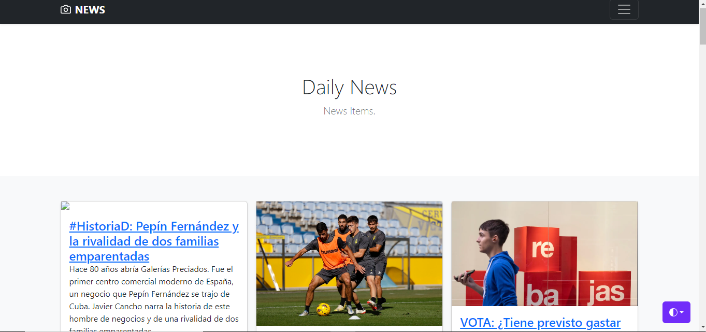

<h1>News Web App</h1>

This is a news web application developed using Django.

## External API Integration

This project utilizes an external API (such as NewsAPI) to fetch the latest news data. The API integration enhances the app's content by fetching real-time news articles.

## Overview

The News Web App is a Django-based platform designed to display the latest news articles. It allows users to read news articles and news content.

## Features

- **Article Display**: View the latest news articles.

https://github.com/chetakm/newsapp/commit/a94793c7d904862ca23315b6fd867d9788cd9802
https://github.com/chetakm/newsapp/blob/master/Screenshot241.png
